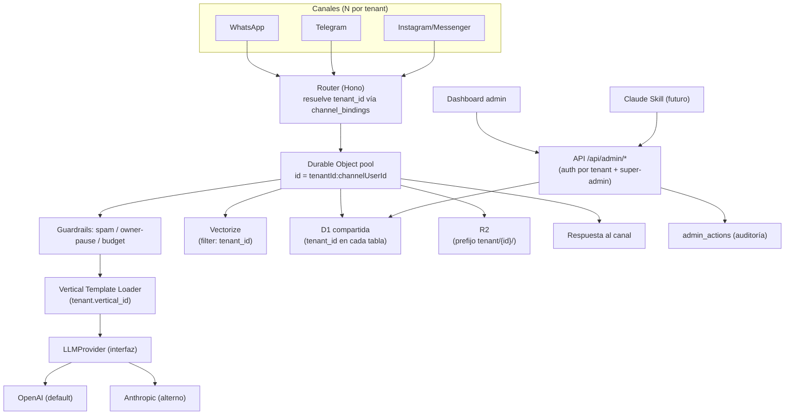

# Radamantis — Arquitectura propia

Punto de partida: Fase 1 (reverse engineering de Forja) completa. Este documento es la Fase 2: diseño propio, sin código de Forja, resolviendo los 3 huecos que Fase 1 identificó (multi-tenancy real, superpoderes sin evidencia de código, capa LLM acoplada).

## 1. Principios de diseño

| # | Principio |
|---|---|
| 1 | Un solo Worker sirve N tenants — no 1 deploy por cliente (a diferencia de Forja). |
| 2 | Alta de cliente = fila en base de datos, nunca `wrangler deploy`. |
| 3 | Agregar un giro = nuevo Vertical Template, cero cambios al core. |
| 4 | LLM desacoplado del proveedor; OpenAI primero, Anthropic intercambiable. |
| 5 | Toda operación de gestión (alta de cliente, config, activar superpower) existe primero como API, para que el futuro Skill de Claude solo la consuma — nunca lógica duplicada. |
| 6 | Superpowers construidos por evidencia real, no por el marketing de Forja+ (4 de 12 no tienen código público que replicar — se construyen desde cero). |

## 2. Decisiones arquitectónicas core

### D1. Multi-tenancy real (vs. infraestructura duplicada de Forja)
- **Problema:** Forja aísla clientes duplicando infraestructura completa (1 Worker/D1/Vectorize/R2 por cliente); no hay tenant routing dentro de una sola app.
- **Decisión:** Un Worker + pool de Durable Objects direccionados por `tenantId:channelUserId`, una D1 con `tenant_id` obligatorio en cada tabla, un índice Vectorize con `tenant_id` en metadata, un bucket R2 con prefijo `tenant/{tenantId}/…`.
- **Justificación:** onboarding se vuelve un INSERT, no un stack nuevo — es el objetivo #1 del proyecto.
- **Impacto:** exige disciplina de aislamiento (ver D3); riesgo de "noisy neighbor" mitigado porque cada conversación ya vive en su propio DO.

### D2. Router resuelve tenant antes que canal
- **Problema:** en Forja el webhook ya sabe a qué bot pertenece porque es el único bot del Worker.
- **Decisión:** tabla `channel_bindings (channel, external_id) → tenant_id`; el router hace ese lookup antes de instanciar el DO.
- **Justificación:** un mismo Worker puede atender N números de WhatsApp / N bots de Telegram de N tenants distintos.
- **Impacto:** nuevo canal para un cliente = INSERT, no código nuevo.

### D3. Aislamiento de datos: D1 compartida + capa de acceso que fuerza `tenant_id`
- **Problema:** D1/SQLite no tiene row-level security nativo como Postgres.
- **Decisión:** repository layer único que inyecta `WHERE tenant_id = ?` en cada query; prohibido SQL crudo disperso en lógica de negocio; índices compuestos `(tenant_id, …)`.
- **Justificación:** es la única forma confiable de evitar fuga de datos entre clientes sin RLS nativo.
- **Impacto:** P0 — requiere tests dedicados de fuga cross-tenant antes de aceptar Fase 2 (Multi-tenant) del roadmap como terminada.

### D4. RAG: índice Vectorize compartido con metadata filtering
- **Problema:** Forja declara el binding R2 `CATALOG` pero ningún archivo lo lee en runtime (gap confirmado en Fase 1); Radamantis necesita RAG real por tenant.
- **Decisión:** un índice único; cada vector con metadata `{tenant_id, vertical_id, doc_id}`; queries con `filter: {tenant_id}`.
- **Justificación:** evita gestionar N índices; es el patrón estándar para RAG multi-tenant.
- **Impacto:** validar con benchmark real el costo/latencia de metadata filtering a escala antes de comprometer la Fase 5 (RAG) del roadmap.

### D5. Capa LLM desacoplada del proveedor — OpenAI primero
- **Problema:** Forja anuncia stack "agnóstico" pero el único secret obligatorio es `ANTHROPIC_API_KEY`.
- **Decisión:** interfaz `LLMProvider` con adaptadores `openai.ts` / `anthropic.ts`; selección por config de tenant, no hardcoded.
- **Justificación:** cumple tu requisito explícito de usar OpenAI como proveedor principal sin acoplarte.
- **Impacto:** necesitas **API key de OpenAI de pago por uso** — tu suscripción ChatGPT Plus/Pro NO da acceso a la API. Riesgo a resolver antes de Fase 4 (Agent).

### D6. Vertical Templates como plugin declarativo
- **Problema:** el mecanismo de extensión de Forja (`NichePack`/`getNiche()`) es real y bien diseñado, pero su contenido (14 giros) vive en backend propietario inalcanzable — no hay nada que "copiar", solo el patrón.
- **Decisión:** esquema declarativo `VerticalTemplate` (JSON/YAML): prompts base, tools habilitadas, JSON-schema de campos de config, schema de KB, superpowers activos por default. El core lo carga por `tenant.vertical_id` en runtime.
- **Justificación:** replica la intención del mecanismo de Forja con contenido propio y abierto, cumpliendo "agregar giro sin tocar el core".
- **Impacto:** el esfuerzo real está en diseñar bien el schema una vez (Alta complejidad); cada giro adicional después es Baja complejidad.

### D7. Superpowers clasificados por evidencia, no por marketing
- **Problema:** de los 12 superpoderes de Forja+, solo 2 tienen código público verificable, 4 tienen mecanismos parcialmente solapados, 4 no tienen ningún rastro (ver `04-superpoderes.md`).
- **Decisión:** cada superpower se ubica en Core (aplica a todo tenant), Vertical-configurable (depende del giro) o Tenant-toggle (opt-in por plan) — ver tabla en sección 7.
- **Justificación:** evita construir 12 features monolíticas copiando una arquitectura que en su mayoría no existe en público.
- **Impacto:** presupuesta como build-from-scratch los 4 superpoderes sin rastro (encuestas, no-shows, reseñas, cobros WhatsApp) — no son "portar código", son desarrollo nuevo.

### D8. Alta de cliente: pipeline de configuración transaccional
- **Problema:** en Forja, alta de cliente = nuevo `wrangler.toml` a mano.
- **Decisión:** una transacción que crea: fila `tenants`, asigna `vertical_id`, crea `channel_bindings`, crea namespace de KB, aplica config default del template, activa superpowers default del vertical.
- **Justificación:** es tu objetivo de negocio explícito — alta en minutos, sin editar archivos por cliente.
- **Impacto:** este pipeline es el entregable de mayor valor; debe resolverse en Fase 2 (Multi-tenant) del roadmap, no diferirse.

### D9. Claude Skill como consumidor de API, no como lógica propia
- **Problema:** si la lógica de alta/gestión vive solo en un dashboard (como en Forja), el futuro Skill tendría que reimplementarla.
- **Decisión:** exponer `/api/admin/tenants`, `/api/admin/verticals`, `/api/admin/channels`, etc. desde el día 1; el Skill (Fase 10) solo orquesta llamadas a esa API.
- **Justificación:** evita lógica duplicada y hace que "convertir Radamantis en Skill" sea trabajo de integración, no de reconstrucción.
- **Impacto:** disciplina API-first obligatoria desde la primera fase de implementación, aunque el Skill se construya al final.

### D10. Seguridad multi-tenant: auth por tenant + auditoría
- **Problema:** Forja usa un único `CONTROL_PLANE_TOKEN` global — no aplica a multi-tenant real.
- **Decisión:** API key/JWT por tenant para APIs de tenant; token de super-admin separado (Cloudflare Access) solo para ti; tabla `admin_actions (tenant_id, actor, action, timestamp)`.
- **Justificación:** sin esto, un bug de autorización expone datos de un cliente a otro.
- **Impacto:** P0 de Fase 2, no se puede posponer a la fase de Agency.

## 3. Diagrama de arquitectura general



## 4. Jerarquía de componentes

```
RADAMANTIS
├── CORE (código único, sin lógica de negocio de un tenant)
│   ├── Router / Auth / Multi-tenancy
│   ├── Agent Engine (DO)
│   ├── LLMProvider (interfaz)
│   ├── RAG engine
│   └── API admin
├── TENANT (config, no código)
│   ├── channel_bindings, KB, branding, plan
├── VERTICAL (template, no código)
│   ├── prompts, tools habilitadas, schema de KB, superpowers default
└── AGENCY (capa superior, futura)
    ├── gestión de N tenants para ti como operador
    └── Claude Skill como cliente de la API admin
```

## 5. Esquema de Vertical Template (ejemplo abreviado — Clínica)

```json
{
  "vertical_id": "clinica",
  "display_name": "Clínica / Consultorio",
  "prompt_base": "prompts/clinica.md",
  "tools_enabled": ["searchKb", "bookAppointment", "handoffHuman", "checkAvailability"],
  "config_schema": {
    "doctores": "array<{nombre, especialidad, horario}>",
    "servicios": "array<{nombre, precio, duracion_min}>",
    "ubicaciones": "array<{nombre, direccion}>"
  },
  "kb_schema": ["faq", "precios", "politicas_cancelacion"],
  "superpowers_default": ["blindaje_anti_invento", "handoff", "recupera_no_shows"]
}
```
Agregar `dentista` o `restaurante` = un archivo nuevo con este mismo shape, cero cambios al core.

## 6. Matriz Forja → Radamantis

| Funcionalidad Forja | Acción | Nota |
|---|---|---|
| Router + DO por conversación | Replicar | Patrón sólido, ya confirmado en Fase 1. |
| Buffering vía alarma de DO | Replicar | Evita respuestas fragmentadas; sin esto la UX de WhatsApp se siente robótica. |
| 1 Worker/D1/Vectorize por cliente | Eliminar | Es la causa raíz de que Forja no sea multi-tenant real (D1). |
| `ANTHROPIC_API_KEY` como único secret obligatorio | Mejorar | Reemplazar por `LLMProvider` desacoplado (D5). |
| Binding R2 declarado pero no leído en runtime | Eliminar/Corregir | Bug de Forja; en Radamantis el RAG debe ser funcional desde el día 1 (D4). |
| Auth admin vía Basic Auth | Mejorar | JWT/API-key por tenant + Cloudflare Access para super-admin (D10). |
| `NichePack` / `getNiche()` con contenido cerrado | Mejorar | Mismo patrón, contenido propio y abierto vía Vertical Template (D6). |
| Watchdog + analyzer nocturno | Replicar | Única pieza de "Vigilante con IA" con evidencia real. |
| Encuestas, no-shows, reseñas, cobros WhatsApp | Agregar | Sin evidencia de código en Forja — desarrollo nuevo (D7). |
| Alta de cliente manual (`wrangler.toml` por cliente) | Eliminar | Reemplazar por pipeline transaccional (D8). |
| — (no existe en Forja) | Agregar | Claude Skill como control plane (D9). |

## 7. Superpowers — ubicación en la jerarquía Core/Vertical/Toggle

| # | Superpower | Evidencia en Forja | Ubicación propuesta en Radamantis |
|---|---|---|---|
| 1 | Blindaje anti-invento | Verificable | CORE (regla de prompt base) |
| 2 | Vigilante con IA | Parcial (watchdog + analyzer) | CORE (salud) + TOGGLE (scoring de sentimiento, plan Pro) |
| 3 | Handoff que sí atina | Verificable | CORE |
| 4 | Cazador de ventas | Parcial | CORE (mecanismo) + VERTICAL (criterio de "venta perdida" varía por giro) |
| 5 | Oído y vista (voz/visión) | Parcial | CORE (capacidad técnica) + TOGGLE (por plan) |
| 6 | Voz de marca | Ver `04-superpoderes.md` | TENANT-CONFIG (tono en config, no en código) |
| 7 | Reportes automáticos | Ver `04-superpoderes.md` | CORE (mecanismo) + TENANT-CONFIG (métricas/cadencia) |
| 8 | Multi-idioma | Parcial | CORE (capacidad de prompt/LLM) |
| 9 | Encuestas de satisfacción | Sin rastro | VERTICAL-CONFIGURABLE — build from scratch |
| 10 | Recupera no-shows | Sin rastro | VERTICAL-CONFIGURABLE (solo giros con agenda) — build from scratch |
| 11 | Pide reseñas | Sin rastro | TENANT-TOGGLE — build from scratch |
| 12 | Cobros por WhatsApp | Sin rastro | TENANT-TOGGLE (requiere integración de pagos) — build from scratch |

## 8. Roadmap resumido

| Fase | Objetivo | Entregable clave | Complejidad | Depende de |
|---|---|---|---|---|
| 0 — Discovery | Cerrar riesgos abiertos (sección 9) | Validaciones técnicas | Baja | — |
| 1 — Core | Router, DO engine, LLMProvider, D1 base | Worker que responde 1 mensaje end-to-end | Alta | Fase 0 |
| 2 — Multi-tenant | Pipeline de alta de cliente (D8), aislamiento (D3), auth (D10) | Alta de un 2° cliente sin tocar código | Alta | Fase 1 |
| 3 — Channels | Adaptadores WhatsApp/Telegram/Instagram con channel_bindings | 2 tenants en 2 canales simultáneos | Media | Fase 2 |
| 4 — Agent | Guardrails, tools base, budget/model selection | Agente conversacional completo | Alta | Fase 1 |
| 5 — RAG | Índice Vectorize + KB por tenant (D4) | Respuestas ancladas en KB real | Media | Fase 2 |
| 6 — Dashboard | Panel admin (consume la API, D9) | Gestión visual de tenants | Media | Fase 2 |
| 7 — Superpowers | Los 12, por evidencia (D7, sección 7) | CORE + primeros TOGGLE activos | Alta | Fase 4 |
| 8 — Verticals | Primer Vertical Template real (Clínica) | Nuevo giro sin tocar core | Media | Fase 6 |
| 9 — Agency | Gestión multi-cliente para ti como operador | Vista consolidada de todos los tenants | Media | Fase 6 |
| 10 — Claude Skill | Skill que consume la API admin (D9) | "Crea cliente: X" funcionando end-to-end | Media | Fase 9 |

## 9. Riesgos abiertos a validar antes de construir

| Riesgo | Por qué importa | Cómo validarlo |
|---|---|---|
| Costo/latencia de metadata filtering en Vectorize a escala | Puede no escalar igual que un índice por tenant | Benchmark con N tenants simulados antes de Fase 5 |
| Suscripción ChatGPT ≠ acceso a API de OpenAI | Bloqueante para D5 si no tienes ya la API key de pago | Confirmar acceso a platform.openai.com con billing activo |
| Ausencia de tests (`test/` de Forja no examinado en Fase 1) | No hay referencia de qué probar | Definir tu propia suite desde Fase 1, no heredar cobertura de Forja |
| D1/SQLite sin RLS nativo | Riesgo de fuga cross-tenant si un desarrollador olvida el filtro | Tests automatizados de aislamiento como criterio de aceptación de Fase 2 |

## 10. Siguiente paso

Este documento cubre Arquitectura + Multi-tenant + Vertical Templates + Claude Skill (diseño) + Roadmap en una sola pasada. Falta, como profundización opcional antes de Fase 3 (implementación): DDL completo de D1, contratos de API (`/api/admin/*`) y definición de tools del Skill. Dime si quieres esa profundización ahora o si con esto ya apruebas para pasar a Fase 3.
